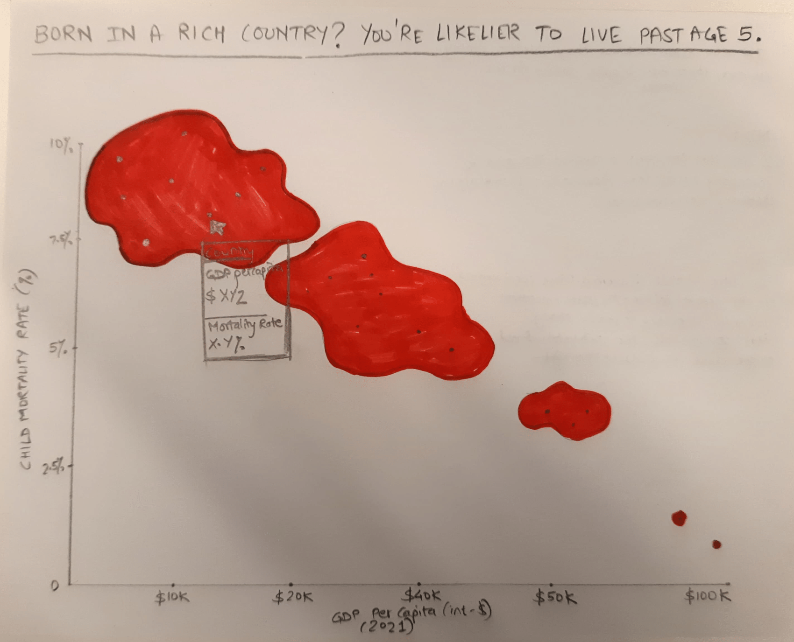
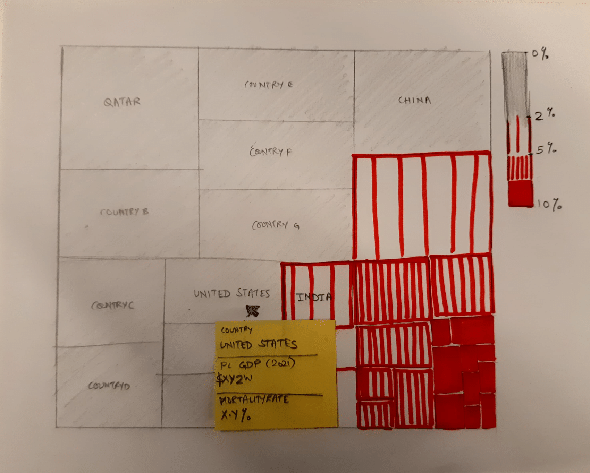
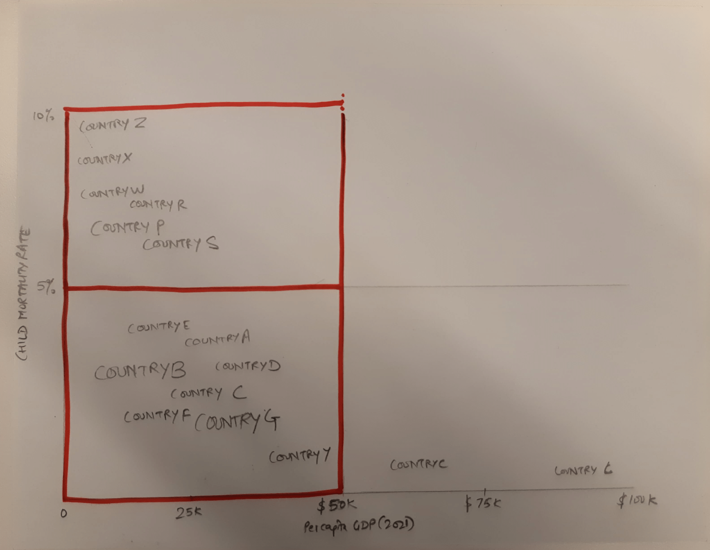

# Critique By Design - MakeoverMonday

This project explores the critique by design technique to improve an existing data viz and unearth the story that lies within.

## Design Process
### Explore - Finding a viz with a hidden story
Step one of the project was finding a data viz on the Makeovermondays website. For me, this viz had to be a blend of three things - a topic I'm passionate about, built upon a complex dataset, and something that could benefit from a revamp. Essentially, it had to be a story worth sharing with the world.

### Examine - Actionable Critique
It's easy to critique, but much harder to improve. This is why in step two, I began to deconstuct and dissect the chosen viz using Stephen Few's Data Visualization Effectiveness Profile. This critical analysis helped me identify the pros and cons of the current viz; what's working, what isn't and most importantly - WHY! Next, I built simple pen-to-paper sketches to see how things could be done differently. At this stage, it was low fidelity execution, high fidelity critical thinking! 

### Evaluate - Relooking at the data, with an external lens
I think data is a language, and languages are a medium of communication. Visualizations don't exist in silos. They are meant to synchronize minds and hearts. This is why, user research was critical to evaluate the sketches and prototypes I built. I conducted semi-structured interviews with five different participants where they engaged with my versions of the viz. I then synthesized user feedback to draw insights and go back to the drawing board.

### Elevate - Re-telling the story
Finally, it was time for high fidelity execution and pixel perfection! It was time to showcase the story I unearthed from the previous viz and present it in a new light!

## Let's dive into each of these steps!

## EXPLORE
From the MakeoverMonday website, I picked the 'Child and Infant Mortality' data viz produced in September 2024 by 'Our World in Data'.

<iframe src="https://ourworldindata.org/grapher/child-mortality-gdp-per-capita?time=2021&tab=chart" loading="lazy" style="width: 100%; height: 600px; border: 0px none;" allow="web-share; clipboard-write"></iframe>

This viz fit my criteria perfectly - it presented healthcare related information (something I'm passionate about), it was built upon a complex data set (per capita GDPs of all nearly all the countries in the world, respective child mortality rates and populations across the years of 1950 to 2022) and lastly it was something that could benefit from a revamp. Child mortality is a crucial issue in today's world as income and health inequity rises across the globe. Currently, the viz did not produce an instant aha! moment or even give an at-a-glance insight to someone who looks at it. This is where I began to......

## EXAMINE
Using Stephen Few's Visualization Effectiveness profile, I dissected the viz and ranked it across the following key parameters - 
#### Informative Parameters - Usefulness, Completeness, Perceptibility, Truthfulness, Intuitiveness
#### Emotive Parameters - Aesthetics, Engagement

Here's a sneak peak into my critique!

#### What worked, What Didn't and Why?
The critique method helped form a comprehensive evaluation of the viz. While the visualization has its strengths, particularly in terms of data integrity and completeness, it falls short in areas like engagement and perceptibility. Overall, I think the viz presents data around the really important and useful topic of child mortality. Child mortality is tied to the world's future and humanity's future as a whole. What stood out to me was that it compared three really distinct factors - countrywise population, mortality rate and per capita GDP. The interplay of these three factors is really interesting because there may be underlying causal relationships between per capita GDP and child mortality due to the confounding variable of 'healthcare spending' of each country. I think what worked really well was the binning of the x and y axes. I found myself looking at the viz in a quandrant method. I looked for the top left - poorest countries with high mortality rates and the lower right - richest countries with lowest mortality rates. I would go ahead and actually try to turn it into four quandrants and use a monochrome palette to show the saturation on the two extremes. This could be a wonderful way to show healthcare inequality. I think what didn't really work well, or rather slowed down my process of understanding the viz was the overuse of colors and the lack of a title. The viz uses too many categorical colors and that too in a scatter plot where the sizes of the dots are affected by the parameter of population. This makes it really hard to register country-to-dot association, and even just notice the smaller dots. If I had to change three things only, here's what I would do. 1) I would change the title to something a lot more contextual. If my audience was the World Health Organization, I would use the title to draw attention to the top left - "It's 2021. African children should be living longer than they are!" 2) I would use the color red to draw attention to specific geographies and highlight the extremities on the viz. 3)I would allow the audience to comapre only two out of the three parameters at a time, making the comorehension a lot easier. I would explore hwo to do this in either a chloropleth map or a heat map form.		
		
#### Key Strengths
Data Integrity - The visualization is based on a reputable UN data source, enhancing its credibility.            
Completeness - It provides all necessary information, including axis labels, tooltips, and a legend.         

#### Key Weaknesses
Perceptibility - The excessive use of colors and categorization creates visual clutter, hindering immediate understanding.       
Usefulness - The lack of a clear title and focus on correlation rather than causation limits its insights.       
Intuitiveness - The scatter plot format, combined with population-based dot sizing and continent-wise coloring, makes it difficult to navigate.       
Aesthetics - The current color scheme and font choices can be improved for better readability and visual appeal.        

#### How can I make it better?

Simplify and Focus     
Clear Title - Writing a concise and informative title that highlights the main message.     
Reduce Color - Using a monochrome color scheme or a limited palette to improve readability.      
Prioritize Insights - Focus on the key correlation or causal relationship between GDP and child mortality rates.     

Enhance Visual Clarity     
Choose Appropriate Chart Type - Using a chloropleth map, heatmap, or bar graph for better visualization of geographical data.      
Optimize Dot Sizing - Exploring alternative methods for representing population size, such as different dot shapes or sizes that are more visually intuitive.     
Improve Labeling - Reducing redundancies and visual clutter by hiding or de emphasizing labels wherever necessary.    

Enhance Engagement     
Tell a Story - Incorporating a narrative or storytelling element to connect the data with the deeply emotional issue of child mortality.      
Highlight Key Findings - Using annotations or callouts to emphasize important trends or insights.     

By addressing these areas, the viz can become more effective in communicating its message, engaging its audience, and providing valuable insights into the relationship between GDP and child mortality rates.

### Key Takeaways from the Critique
Having three parameters of GDP, mortality rate and country wise population interplaying together was doing the viz more harm than good. The over categorization by color and dots - through countries, continents and across the years of 1950 to 2022 was overwhelming as a audience. To curtail this overwhelm, I decided to work with the subsection of the 2021 dataset. I conducted user interviews to get an external and objective perspective on whether or not I should remove either the population or GDP parameter from the interplay.

User research for information design was a novel experience. And it also gave me a great break from looking at multi-colored dots that were now starting to hypnotize me from looking at them for too long!

## EVALUATE
At the end of the critique, I went back to the drawing board to create my own iterations of the viz. Below are a few sketches I created to explore how the same data can be visualized in a more stylized, and abstract density graph, a treemap and a quandrant map.

This iteration was meant to be a more abstract, graphical representation using a density graph. It focused more on getting an emotional reaction to the data.

For this sketch, the idea was to show the difference in GDP and mortality rates using spatial relationships and color saturation. It de emphasized population as a parameter. So Qatar with the highest GDP, became the biggest grey 'square' on the tree map (since it had the lowest mortality rate). Whereas, Niger became the smallest square with the darkest red color.     

Lastly, this sketch tried to segregate the countries into high-income low-income quadrants. The country names would show up as text within the quadrants.

### User Feedback and Quotes       
I interviewed 5 participants (including the in-class critique) of varying backgrounds, ethnicities, ages and gender. I wanted to map patterns of commonalities across different users to identify potential areas of improvement.     

I used to show the original viz first, then let them speak a bit about their thoughts on it. Then, I showed my three iterations and solicited feedback on them. The overall observation across the participants was that I was headed in the right direction. People usually understood what was happening/ what was being compared in my sketches. However, there were some noteworthy aha! moments that arose during the interviews.    

RP, 28 F    
Speaking about the original viz -     
*"I don't know why population, GDP and mortality are being compared all at once. It makes sense to compare mortality with either but seeing it all together is rather confusing. The headline doesn't do much to help either."*   

ND, 22 M    
Speaking about the iterated sketches -     
*"The first graphical one is really bold and kind of scarred me a little bit. As for the treemap, I would still need explanation on how the box sizes and color saturation is being defined. It's not exactly clear at the moment"*

MK, Age unknown, F  
Speaking about the iterated sketches -     
*"I don't see the reason behind depicting all countries at once. I'm not able to focus on any one. I think it would be better to have some kind of aggregates here."*   

The user research proved instrumental in making a giant leap from my sketches to the final elevated re-telling fo the story. Some key insights from the research were -     
#### The audience can comprehend only two parameters being compared at once, without any strain. It is worth it to de emphasize or eliminate the population parameter as it does not directly impact mortality.      
#### There is a confounding variable of 'healthcare spending' that supports the correlation of per capita GDP and child mortality. Making that variable more visible is essential for an impactful revamp.    
#### Comparing all countries at once does not provide any significant takeaway or at-a-glance revelation to the audience. Grouping the data into appropriate regions would make it easier for the audience to understand trends and relationships between the parameters.   
#### Locking in on a prospective audience will dictate the storytelling style, and is thus essential in deciding the final form of the viz.

Based on these insights, it was time for some Tableau and visual design magic!

## ELEVATE

I started off by cleaning up the dataset to eliminate any null/redundant values, retaining only the entired from 2021 that had all three values - GDP, mortality rate and population. At this juncture, I decided that the audience for my viz is going to be research-proficient executives from international health and welfare entities. My viz would help the intended audience support claims of healthcare and wealth inequity and inequality, and promote initiatives that combat it. Then, based on the insights and exploration of data viz forms, I decided to eliminate the link between mortality rates and population sizes. This allowed me to focus on ways to demonstrate how GDP and mortality are correlated. Finally, I aggregated the country-specific values into continents of Africa, Asia, North America, South America and Oceania. This helped me limit the number of categories being compared and instead draw focus on the overarching global trend between per capita GDP and child mortality.       

Finally, I chose a line chart to show the inverse relationship between per capita GDP and child mortality rates across continents. This form of the viz made the story clear at the first glance and elicited an aha! response from everyone I shared it with. 

Here's the revamped viz that illustrated how the per capita GDP of continents correlates with respective child mortality rates.   

<html lang="en">
<head>
    <meta charset="UTF-8">
    <meta name="viewport" content="width=device-width, initial-scale=1.0">
    <title>Tableau Viz</title>
</head>
<body>
    

        <noscript>
            
        </noscript>
        <object class='tableauViz' style='display:none;'>
            <param name='host_url' value='https%3A%2F%2Fpublic.tableau.com%2F' /> 
            <param name='embed_code_version' value='3' /> 
            <param name='site_root' value='' />
            <param name='name' value='EconomicGrowthALifelineForChildren/Sheet1' />
            <param name='tabs' value='no' />
            <param name='toolbar' value='yes' />
            <param name='static_image' value='https://public.tableau.com/static/images/Ec/EconomicGrowthALifelineForChildren/Sheet1/1.png' />
            <param name='animate_transition' value='yes' />
            <param name='display_static_image' value='yes' />
            <param name='display_spinner' value='yes' />
            <param name='display_overlay' value='yes' />
            <param name='display_count' value='yes' />
            <param name='language' value='en-US' />
            <param name='filter' value='publish=yes' />
        </object>
    

    
</body>
</html>

