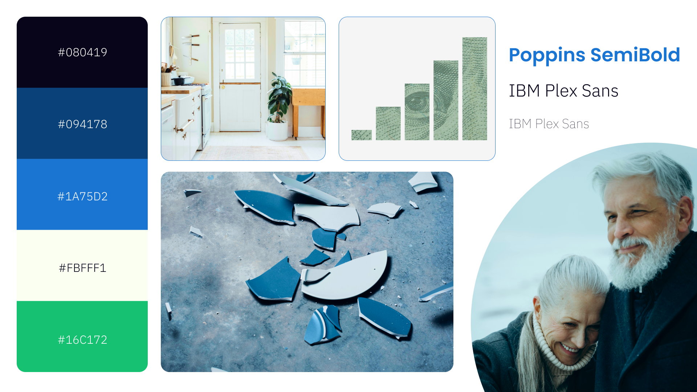

# Part II 

## Wireframes / Storyboards
> I used a combination of Figma and Shorthand to put the storyboard/wireframes together and some Tableau experimentation to create the data vizs. I started off by creating static visuals in Figma in order to keep the focus on the narrative and refine the persuasive appeal of the story arc. The goal was to not get distracted by animations, transitions and other additions which could be integrated later. Below is a work in progress Shorthand draft of the storyboard.

[Shorthand Storyboard](https://preview.shorthand.com/fBCejgzfARXws9ah)

## User research 

### Target audience
> Since my target audience is from the 40-55+ age group, I had to get innovative to find representative users. I contacted some of my family members who are in that age bracket and have lived in the USA for more than two decades. I also leveraged my friend's network and family to identify participants. These weren't exactly from the same socio economic background as my target audience, but I could test my storyboard for general comprehension, appeal and perceived impact.

I identified three participants, as mentioned below. The goal was to cover the broad age spectrum. I also tried to engage in informal conversation before the interviews to identify their general awareness about the impact of home modifications/home improvement. Based on my understanding, I marked them as having beginner, intermediate and advanced levels of awareness. I tried to estimate this level of awareness and didn't ask any explicit questions about it in order to avoid biasing them about my story.

| Initials | Age | Awareness about Home Mods |
|------|----------|-----------------------------------|
|  BS  |     55 years     |     Beginner     |
|  AA  |      40 years    |     Intermediate     |
|  AS    |    58 years      |     Advanced     |

### Interview script
> Research Goal: Understanding the extent to which the story can appeal to the user and push them to introspect about getting a holistic home mod evaluation.    
> I wanted to gather raw, unfiltered reactions from my participants and therefore, I decided to conceal the fact that the storyboard was my own creation.

Below is an overview of my interview protocol.

| Goal | Questions to Ask |
|------|------------------|
|  Understanding first impressions    | As you went through the storyboard, what thoughts came to your mind?                 |
|   Evaluating visual language    | What do you think about the colors and visuals used in the storyboard? Did the images speak to you? Did you like or dislike a particular visual?                 |
|   Assessing clarity of CTA    | Intuitively, what next step would you take after viewing this story? How did the ending of the story make you feel?                 |
|   Measuring viz comprehension   | Can you walk me through your understanding of the data vizualizations? What did you like/dislike about them? Was there anything that stuck with you?               |
|   Assessing legibility    |  Was all the text legible? Did you have trouble reading or comprehending any particular section?                |

### Interview findings
> There were some patterns across the answers I got in the three interviews that helped me focus on the key areas of improvement. All participants conveyed that the color palette felt a little flat at times and didn't successfully convey the impact of the message. In some places, the font weight in the body copy was too thin. But the most important feedback was about the data viz and the links between them. Between the initial pie chart showcasing GenX's contribution to the economy, to the line chart about in-home falls - participants thought there was too much of a contextual jump. They also expressed that the split bar chart showing the healthcare cost saved by each home mod was a little hard to comprehend.  

Below are some of the questiosn that brought out the most valuable responses.

| Questions               | Interview 1  | Interview 2 | Interview 3 |
|-------------------------|--------------------------------|-------------|-------------|
| Can you walk me through your understanding of the data vizs? | I'm not quite sure I understand the link between individual home mods and the cost saved by them. How are you making that association? I think it would be better to just see evidence that people who opted for home mods had lesser accidents or stayed longer at home.           | I'm a little doubtful about the split bar charts. I don't know what they mean... Maybe try a different way?             | I really like the line chart that shows the rise of in-home falls. I really think it's an important thing that should be emphasized. I don't quite understand the bar chart though.             |
| How did the ending make you feel?                        | I think I really enjoyed the story arc. I never thought of home mods in this perspective. I think I would be really inclined to find out what the holistic home mod is. Can you give more info about it at the end?                               | I'm not too sure about the AARP CTA. It made me feel old suddenly, after feeling so empowered at the beginning of the arc. It's just the association of AARP with aging I guess.            | I really want to find out more about the holistic home mod and how its different from a regular one. I felt like home mods didn't need to be sad, clinical and make me feel like an oldie. I think there's another way to look at it and I'm curious to find out.             |
| Was all the text legible? Did you have trouble reading?                        | In a lot of places the body copy font was too thin and light. I use reading glasses and it made me strain my eyes.                                | I really like the colors and fonts. The titles are bold and give me confidence about the content. I'd double check the lightness of the font.            | The font size for the body copy was a little smaller than I'm used to reading. It would be helpful to fix that. Have you thought about what size of screen this is presented in?            |

## Identified changes for Part III
> Following were the high-level areas of changes to be made in Part III  

| Research synthesis                       | Anticipated changes for Part III                                                |
|------------------------------------------|---------------------------------------------------------------------------------|
| Sometimes too simple can make things complex | I plan to change the split bar chart viz since people can't instantly form a meaningful connection between types of home mods and saved healthcare costs. Alternatively, I plan to add either a line chart showing home mod investment versus reduction in at-home falls. Another option is turn the split bar chart into a grouped bar chart|
| Color Dynamism - Credibility versus Drama                                         | I realized that my mature color palette was taking away from the dramatic effects of the story. I will reconsider some images and play around with the percentages of individual colors to curate more drama into the storyline.                                                                                |
| Designing for accessibility            | My participants being middle aged, struggled with reading the lighter weight IBM Plex. I will be increasing the font weight and size to make it more accessible for my target age group.                                                                                |

> Overall, I think the user research helped shed light on things I failed to cover. Especially the accessiblity and the connection between the vizs. I think I knew the story too well and therefore it was a classic tappers versus listeners phenomenon during user testing. 

## Moodboards / personas
> Since my story was anchored to one of my internship projects, I largely borrowed the color palette from the comapny's brand guidelines. However, I did make some small tweaks in the moodboard to reflect the tone of voice of my storytelling. I used a balanced and cool color palette to appeal to the mature sensibilities of my audience (40 - 55 year olds), and used the blues and greens to evoke a sense of trust, reliability and credibility. The visual language and imagery is meant to be slightly metaphorical, since I wanted to avoid showing any explicit images of falls, accidents, and other mishaps. I had to walk a thin line to get the message across without throwing off my audience. Or rather, I didn't want to use negative imagery that would evoke strong emotional reactions, as a threat or bait. 

Here's the moodboard I created for my story.

I decided to refine my user persona/archetype since Part I, and made it more concise to retain the most important things I need to remember while I design for them.  

> ### Proactive Planner    
> 45-55 years old, Low to middle income ($40k-$80k annually)
>          
> Occupation: Skilled trades, clerical work, or other mid-level careers nearing retirement       
  
> Family: Likely has grown or nearly grown children, may also be caring for aging parents     

> Home Ownership: Majority are homeowners, with properties that may be 20+ years old and in need of renovation or modification  

> Motivations: As they approach retirement age, they are motivated by the desire to live comfortably in their homes for as long as possible. They are looking for ways to safeguard their health and independence while managing the financial aspect of home improvements on a budget.
 
> Pain Points: They are aware of the rising costs of healthcare and assisted living

> Barriers: While concerned about future risks, they may lack awareness of available home modifications or feel overwhelmed by the costs associated with such improvements. They may also be unsure about how to begin the process or who to trust for the work.      
