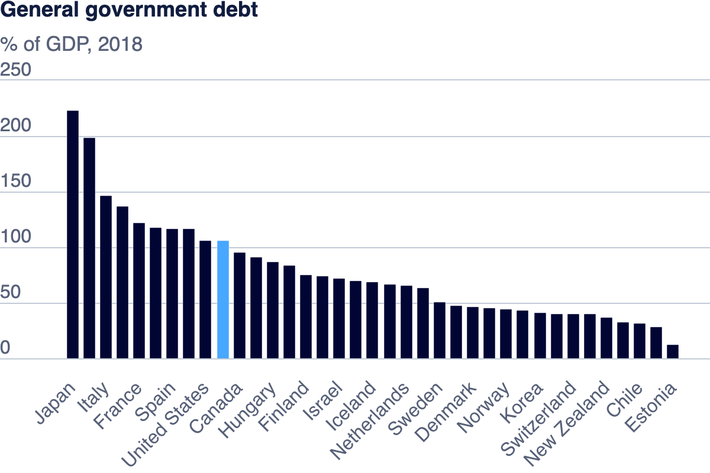

# Visualizing Government Debt

General government debt is the gross debt of the general government as a percentage of GDP.
Debt is calculated as the sum of the following liability categories where applicable: currency and deposits; debt securities, loans; insurance, pensions and standardised guarantee schemes, and other accounts payable. A key indicator for the sustainability of government finance, changes in government debt over time primarily reflect the impact of past government deficits.
This indicator is measured as a percentage of GDP.

The three parts in this project aim to use different forms of data viz to tell different stories about country-wise debt as a % of GDP, for different durations of time. In light of all the significant events that have happened from 1995 till date, it is fascinating to see how different economies have endured in reaction to Globalisation, The Great Recession, Covid 19, and other historic events.

## Part 01: General Government Debt (Data source:OECD)

In this part, I explored the OECD's online data viz platform by experimenting with the dataset of different countries' debt %. I examined how the viz changes with respect to filters for duration and countries. With the simple bar chart preset, what I noticed in the first glance was Greece's sharp spike in debt over the decades. 

In case the image doesn't load, please click on this link to see the viz - <a rel="noopener noreferrer" href="https://data-viewer.oecd.org?chartId=d9a1e503-528a-42bc-b50b-3f670aff1254" target="_blank">Dataflow</a>

## Part 02: Getting Started with Tableau

Building the heatmap to get familiar with Tableau was a very engaging experience. I spent most of my time trying to explore the different viz forms suggested by Tableau and making a note of how switching dimensions and measures between rows and columns can cause drastic changes in visuals. The heatmap form of data viz is great at showcasing the rate of change of debt across the decades, especially for countried such as Japan. It achieves this through the use of dichromatic color saturation scales. However, what's distracting about this form is the % number within each cell, which in my opinion, does more harm than good by creating visual clutter. 

<html lang="en">
<head>
    <meta charset="UTF-8">
    <meta name="viewport" content="width=device-width, initial-scale=1.0">
    <title>Government Debt Visualization</title>
</head>
<body>
    

        <noscript>
            
        </noscript>
        <object class='tableauViz' style='display:none;'>
            <param name='host_url' value='https%3A%2F%2Fpublic.tableau.com%2F' />
            <param name='embed_code_version' value='3' />
            <param name='site_root' value='' />
            <param name='name' value='Country-wiseGovernmentDebt1995to2019/Sheet1' />
            <param name='tabs' value='no' />
            <param name='toolbar' value='yes' />
            <param name='static_image' value='https://public.tableau.com/static/images/Co/Country-wiseGovernmentDebt1995to2019/Sheet1/1.png' />
            <param name='animate_transition' value='yes' />
            <param name='display_static_image' value='yes' />
            <param name='display_spinner' value='yes' />
            <param name='display_overlay' value='yes' />
            <param name='display_count' value='yes' />
            <param name='language' value='en-US' />
            <param name='filter' value='publish=yes' />
        </object>
    

    
</body>
</html>

## Part 03: Creating a New Visualization

I decided to choose a sub section of the large data set to tell a story. This was because I wanted to narrow in on particular economies and possible perform a comparative analysis on different countries. The most challenging part about this section was choosing the right sub section of the data. I spent most of time conducting experiments with the parameters. I tried to compare one country against two, five or even ten others to try and tap into the signal amidst the noise. I also complimented this with different variations of viz forms such as bar charts, geographical maps, scatter plots, etc. 

I then decided to take a more inquisitive approach to choosing a sub section - What are the top superpowers? What geographies are they from? Have they reported debt across the same years? Were they a part of the World Wars? How did the Recession affect them? I was pretty much narrowed down on Great Britain, Japan, Italy, France, Germany, and USA at this point. However, the data for Russia and China was missing which made it hard to draw comparisons w.r.t the war or the recession. Ultimately, the lightbulb moment was when I was comparing the start and end point debts of these countries from 1995 to 2019. 

I discovered that Japan and USA started off with nearly the same debt as a % of their respective GDP in 1995. However, over the decades, Japan's debt became almost twice as much as that of USA's (as a % of GDP). This was a great insight, because both the countries are considered superpowers from opposite hemispheres of the world, and have equal sway over the global economy. I chose a line chart to draw a comparison of their debts because this viz form resembled a "path" along the history/timeline. I also color coded the lines as per country-specific conventions (red for Japan, blue for USA). Lastly, I changed the x and y axis labels and the binning to reflect appropriate intervals. This graphic can best serve economists or political analysts examining risks and/or threats to US or Japan's economies, or bilateral ties between the two countries.
 
<html lang="en">
<head>
    <meta charset="UTF-8">
    <meta name="viewport" content="width=device-width, initial-scale=1.0">
    <title>Tableau Visualization</title>
</head>
<body>
    

        <noscript>
            
        </noscript>
        <object class='tableauViz' style='display:none;'>
            <param name='host_url' value='https%3A%2F%2Fpublic.tableau.com%2F' /> 
            <param name='embed_code_version' value='3' /> 
            <param name='name' value='DivergingDebtPaths-USAandJapan&#47;Sheet1' />
            <param name='tabs' value='no' />
            <param name='toolbar' value='yes' />
            <param name='static_image' value='https://public.tableau.com/static/images/Di/DivergingDebtPaths-USAandJapan/Sheet1/1.png' />
            <param name='animate_transition' value='yes' />
            <param name='display_static_image' value='yes' />
            <param name='display_spinner' value='yes' />
            <param name='display_overlay' value='yes' />
            <param name='display_count' value='yes' />
            <param name='language' value='en-US' />
            <param name='filter' value='publish=yes' />
        </object>
    

    
</body>
</html>

## Conclusion
This project was a great introduction to the practice of conducting exploratory analysis using Tableau and other online tools, to extract signals from noise. It helped me understand how to look for stories within tangled messes of numbers and data points. One key takeaway from this exercise was that the design process for data viz is often bottom-up, instead of top-down. You can'tpre- decide what the graphic is going to be about, unlike an artwork. Getting down into the weeds of the data can reveal something impactful and beautiful. I can almost draw a parallel to the skill of sculpture. The statue always exists within - the skill lies in eliminating the stone that surrounds it.
