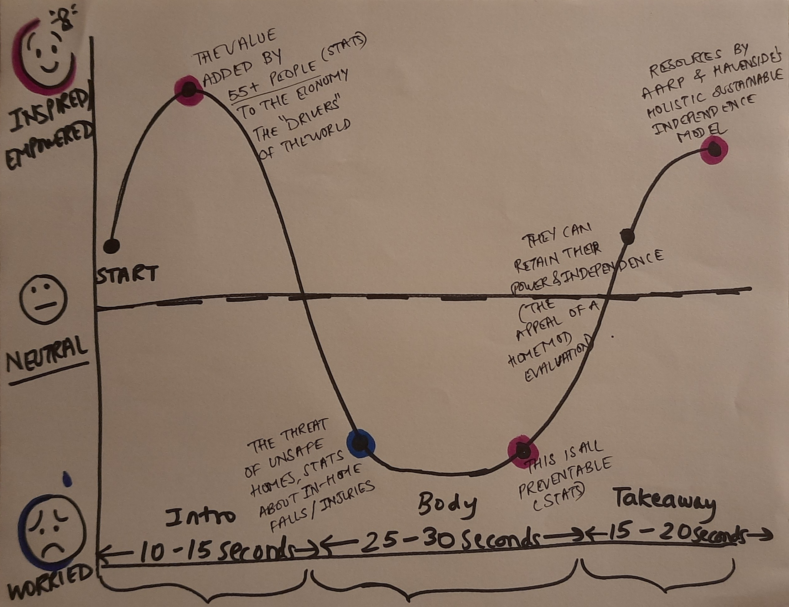

# Final Project Part I

## Project Outline
By 2054, 23% of the U.S. population will be over 65, representing a rapidly growing demographic approaching the challenges of aging. For this group, there remains a surprising lack of awareness and proactiveness in safeguarding their long-term independence, especially through home modifications. This project explores the significant, long-term value of holistic home modifications, which can help seniors maintain physical autonomy, reduce the risk of injury, and avoid the high costs associated with assisted living or healthcare.         
We will evaluate various home modification strategies, such as installing ramps, widening doorways, enhancing bathroom safety, and integrating smart home technologies. we aim to demonstrate how these adjustments not only provide immediate safety benefits but also result in substantial cost savings over time. Ultimately, the project will offer a roadmap for those approaching senior status to take proactive steps, ensuring a safer, more independent lifestyle while potentially saving thousands of dollars—and even their lives.

The intent is to use this story as a targeted marketing piece for a specific home modification business in Southwest PA. It may later be plugged into the website of that business, so the visual language and tone of voice will be curated in keeping with that touchpoint. The intended audience for this is low to middle income, 45-55 year old US citizens who are towards the end of their professional career. 

Here's an example archetype of the audience.
#### The Proactive Young Senior
##### Demographics:      
Age: 45-55 years old       
Income: Low to middle income ($40k-$80k annually)       
Location: United States          
Occupation: Skilled trades, clerical work, or other mid-level careers nearing retirement      
Family: Likely has grown or nearly grown children, may also be caring for aging parents        
Home Ownership: Majority are homeowners, with properties that may be 20+ years old and in need of renovation or modification     

##### Psychographics:       
Mindset: These individuals are practical, forward-thinking, and focused on ensuring stability in their later years. They’ve worked hard for decades and are beginning to think about retirement, with a strong desire to maintain independence and avoid burdening their families.         
Motivations: As they approach retirement age, they are motivated by the desire to live comfortably in their homes for as long as possible. They are looking for ways to safeguard their health and independence while managing the financial aspect of home improvements on a budget.   
Pain Points: They are aware of the rising costs of healthcare and assisted living and are concerned about the financial and physical strain of aging in a home that isn’t equipped to meet their needs.      
Barriers: While concerned about future risks, they may lack awareness of available home modifications or feel overwhelmed by the costs associated with such improvements. They may also be unsure about how to begin the process or who to trust for the work.     

##### Needs:    
Solutions that ensure long-term safety and independence—without requiring a massive upfront investment.     
Clear, straightforward guidance on affordable home modification options, especially those that provide tangible health and financial benefits.     
Trustworthy contractors who understand both the structural challenges of aging homes and the specific needs of aging individuals.    

#### One-Sentence Description of the Project -    
Installing a grab bar can save young seniors* thousands of dollars in healthcare costs, and potentially their life - but they're unaware.    

#### Audience User Story -    
As an older adult, I want to protect and modify my home so that I can remain healthy, independent and age in place.    

#### Action Item -   
I can do this by exploring platforms such as AARP, and getting a holistic home mod evaluation from (X) business.    

#### Story Arc -   

I want to take my audience through a sinusoidal wave of emotions. The introduction will reaffirm their self worth by showcasing how much value they add to the world. Research has shown that Gen X associates their self worth with their work, and the story uses this basis of their mental model to affirm the tangible and significant value they add to the economy. I will present stats about their contribution to GDP, workforce participation and spending power.   
In the next part, I create a sudden contrast by taking them to a low point and presenting the threat of unsafe homes and in-home falls and injuries. Next, there is a glimmer of hope as I show them that this is preventable. Finally, in the conclusion, I show them the appeal of a holistic home mod evaluation which can help them sustain their independence and happiness. I will present calls to action by giving them resources such as the AARP website, and X business's holistic home mod evaluation inquiry form.

## Initial Sketches   

## Data Sources
AGING IN THE UNITED STATES: A STRATEGIC FRAMEWORK FOR A NATIONAL PLAN ON AGING (https://acl.gov/sites/default/files/ICC-Aging/StrategicFramework-NationalPlanOnAging-2024.pdf)   
Pew Research Center - US Centenarian Population (https://www.pewresearch.org/short-reads/2024/01/09/us-centenarian-population-is-projected-to-quadruple-over-the-next-30-years/#:~:text=Centenarians%20currently%20make%20up%20just,to%20reach%200.1%25%20in%202054.)     
Trinet, Generational Differences in the Workplace (https://www.trinet.com/insights/generations-in-the-workplace-boomers-gen-x-gen-y-and-gen-z-explained)     
Brookings, The Age of Longevity (https://www.brookings.edu/articles/the-age-of-the-longevity-economy/#:~:text=In%202024%2C%20older%20adults%20account,will%20continue%20to%20steadily%20rise.)     
AARP, The Longevity Economy Outlook (https://www.aarp.org/research/topics/economics/info-2019/longevity-economy-outlook.html)    
NSC, Injury Facts (https://injuryfacts.nsc.org/home-and-community/deaths-in-the-home/introduction/)  
(https://injuryfacts.nsc.org/home-and-community/home-and-community-overview/deaths-in-the-home-and-community-by-age-group-and-cause/)     
CDC Older Adult Fall Prevention (https://www.cdc.gov/falls/data-research/index.html)  
NCOA, Facts on Fall Prevention (https://www.ncoa.org/article/get-the-facts-on-falls-prevention/)     
AHRQ, Falls Dashboard (https://www.ahrq.gov/npsd/data/dashboard/falls.html)     
NPJ, Healthcare on the brink (https://www.nature.com/articles/s41514-024-00148-2#:~:text=The%20rising%20tide%20of%20healthcare,spending%2C%20and%20complex%20medication%20management.)    
EMarketer, Elderly Population and Healthcare Problems (https://www.emarketer.com/insights/aging-population-healthcare/)   
National Institute on Aging, Preventing Falls at Home (https://www.nia.nih.gov/health/falls-and-falls-prevention/preventing-falls-home-room-room)   
NCOA, Home Modification Tools and Tips (https://www.ncoa.org/article/home-modification-tools-and-tips-to-help-prevent-falls/)
CDC, Cost of Older Adult Falls (https://stacks.cdc.gov/view/cdc/122747#:~:text=National%20Center%20for%20Injury%20Prevention%20and%20Control%20(U.S.),-Description%3A&text=adult%20falls%202014-,Falls%20among%20adults%20age%2065%20and%20older%20are%20very%20costly,spent%20related%20to%20fatal%20falls.)    
Brooks Health, The Cost of Falling (https://brooksrehab.org/news/the-cost-of-falling/)   
National Library of Medicine, Medicals Costs of Older Adult Falls (https://www.ncbi.nlm.nih.gov/pmc/articles/PMC6089380/)

## Method & Medium

For this project, I intend to use a combination of Tableau, Flourish, Figma and Shorthand. Tableau and Flourish will be used mainly for the key data visualisations. I intend to use Figma and Shorthand for any specific interactions and animations that may complement my storytelling.
